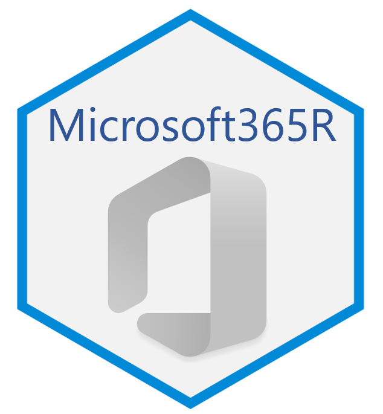

# Microsoft365R 

[](https://cran.r-project.org/package=Microsoft365R)


Microsoft365R is intended to be a simple yet powerful R interface to [Microsoft 365](https://www.microsoft.com/en-us/microsoft-365) (formerly known as Office 365), leveraging the facilities provided by the [AzureGraph](https://cran.r-project.org/package=AzureGraph) package. Currently it supports Microsoft Teams, Outlook, SharePoint Online, and OneDrive.

The primary repo for this package is at https://github.com/Azure/Microsoft365R; please submit issues and PRs there. It is also mirrored at the Cloudyr org at https://github.com/cloudyr/Microsoft365R. You can install the development version of the package with `devtools::install_github("Azure/Microsoft365R")`.

## Authentication

The first time you call one of the Microsoft365R functions (see below), it will use your Internet browser to authenticate with Azure Active Directory, in a similar manner to other web apps. See [app_registration.md](https://github.com/Azure/Microsoft365R/blob/master/inst/app_registration.md) for more details on the app registration and permissions requested. The "Authentication" vignette describes the authentication process in greater depth, including optional arguments and troubleshooting common problems. 

## Client functions

Microsoft365R defines a number of top-level client functions to access the individual Microsoft 365 services. Below are some simple code examples that show how to use the package. For more information, see the vignettes for the individual services.

### OneDrive

To access your personal OneDrive call `get_personal_onedrive()`, and to access OneDrive for Business, call `get_business_onedrive()`. These return an R6 client object of class `ms_drive`, which has methods for working with files and folders. `

```r
od <- get_personal_onedrive()
odb <- get_business_onedrive()

# list files and folders
od$list_items()
od$list_items("Documents")

# upload and download files
od$upload_file("somedata.xlsx")
od$download_file("Documents/myfile.docx")

# create a folder
od$create_folder("Documents/newfolder")

# open a document for editing in Word Online
od$open_item("Documents/myfile.docx")

# working with data frames and R objects
od$save_dataframe(iris, "Documents/iris.csv")
iris2 <- od$load_dataframe("Documents/iris.csv")

wtmod <- lm(wt ~ ., data=mtcars)
od$save_rds(wtmod, "Documents/wtmod.rds")
wtmod2 <- od$load_rds("Documents/wtmod.rds")
```

### SharePoint Online

To access a SharePoint site, use the `get_sharepoint_site()` function and provide the site name, URL or ID. You can also list the sites you're following with `list_sharepoint_sites()`.

```r
list_sharepoint_sites()
site <- get_sharepoint_site("My site")

# document libraries
site$list_drives()

# default document library
drv <- site$get_drive()

# a drive has the same methods as for OneDrive above
drv$list_items()
drv$open_item("teamproject/plan.xlsx")

# lists
site$get_lists()

lst <- site$get_list("my-list")

# return the items in the list as a data frame
lst$list_items()
```

### Teams

To access a team in Microsoft Teams, use the `get_team()` function and provide the team name or ID. You can also list the teams you're in with `list_teams()`. These return objects of R6 class `ms_team` which has methods for working with channels; in turn, a channel has methods for working with messages and transferring files.

```r
list_teams()
team <- get_team("My team")

# associated SharePoint site and drive
team$get_drive()
team$get_sharepoint_site()

# channels
team$list_channels()

chan <- team$get_channel("General")

# messages
chan$list_messages()
chan$send_message("Hello from R", attachments="hello.md")

msg <- chan$get_message("msg-id")
msg$send_reply("Reply from R")

# files: similar methods to OneDrive
chan$list_files()
chan$download_file("myfile.docx")
```

### Outlook

Microsoft365R supports sending, receiving and managing emails in Outlook. Use the `get_personal_outlook()` method to access your emails for your personal account, and `get_business_outlook()` for your work or school account. Emails can optionally be composed using either the blastula or emayili packages.

```r
outl <- get_personal_outlook()
outlb <- get_business_outlook()

# compose an email with blastula
library(blastula)
bl_body <- "## Hello!

This is an email message that was generated by the blastula package.

We can use **Markdown** formatting with the `md()` function.

Cheers,

The blastula team"

bl_em <- compose_email(
    body=md(bl_body),
    footer=md("sent via Microsoft365R")
)
em <- outl$create_email(bl_em, subject="Hello from R", to="bob@example.com")

# add an attachment and send it
em$add_attachment("mydocument.docx")
em$send()

# list the most recent emails in your inbox
emlst <- outl$list_emails()

# reply to the most recent email
emlst[[1]]$
    create_reply("Replying from R")$
    send()
```

----
<p align="center"><a href="https://github.com/Azure/AzureR"></a></p>

